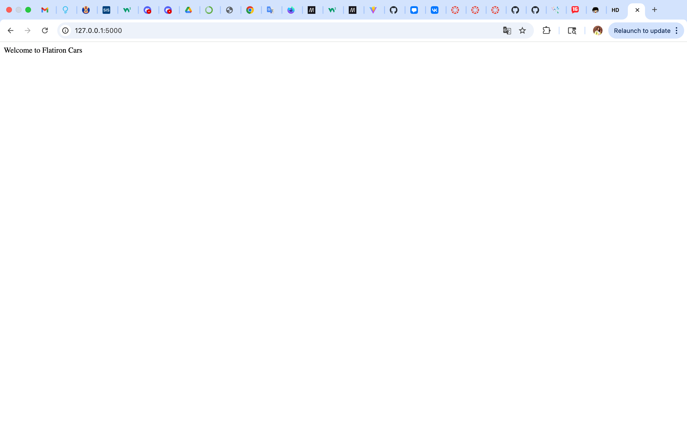

# Flatiron Cars - Flask Routes Application

A Flask web application that provides routes for querying car model information in the Flatiron Cars fleet.

---

## Overview

This application serves as a simple API for checking if car models exist in the Flatiron Cars catalog. It provides two main routes:

- A **default route** (`/`) that introduces the company
- A **model-specific route** (`/<model>`) for requesting information on a specific car model

---

## Features

### Routes

#### `GET /`
Returns a welcome message introducing Flatiron Cars.

**Response:**
```
Welcome to Flatiron Cars
```

#### `GET /<model>`
Checks if a specific car model exists in the Flatiron Cars fleet.

**Parameters:**
- `model` (string): The name of the car model to check

**Response (Model Found):**
```
Flatiron {model} is in our fleet!
```

**Response (Model Not Found):**
```
No models called {model} exists in our catalog
```

**Example Requests:**
- `GET /Beedle` → `"Flatiron Beedle is in our fleet!"`
- `GET /Crossroads` → `"Flatiron Crossroads is in our fleet!"`
- `GET /Tesla` → `"No models called Tesla exists in our catalog"`

---

## Available Models

The following car models are currently available in the Flatiron Cars fleet:

- Beedle
- Crossroads
- M2
- Panique

---

## Screenshot



*Screenshot showing the Flask application running with successful route responses.*

---

## Installation

### Prerequisites

- Python 3.8.13 or higher
- pipenv (for dependency management)

### Setup

1. **Clone the repository**
   ```bash
   git clone <repository-url>
   cd python-flask-car-routes-lab
   ```

2. **Install dependencies**
   ```bash
   pipenv install
   ```

3. **Activate the virtual environment**
   ```bash
   pipenv shell
   ```

---

## Running the Application

### Development Server

To run the Flask development server:

```bash
python server/app.py
```

Or using Flask CLI:

```bash
export FLASK_APP=server/app.py
flask run
```

The application will be available at `http://localhost:5000`

### Testing

Run the test suite using pytest:

```bash
pipenv run pytest
```

Or:

```bash
python -m pytest server/testing/app_test.py -v
```

All tests should pass, confirming that:
- The index route (`/`) returns the correct welcome message
- The model route (`/<model>`) correctly identifies existing models
- The model route returns appropriate messages for non-existent models

---

## Project Structure

```
python-flask-car-routes-lab/
├── server/
│   ├── app.py              # Main Flask application
│   └── testing/
│       ├── app_test.py     # Test suite
│       └── conftest.py     # Pytest configuration
├── Pipfile                 # Python dependencies
├── Pipfile.lock           # Locked dependency versions
├── pytest.ini             # Pytest configuration
└── README.md              # This file
```

---

## Code Documentation

The application code includes comprehensive comments explaining:
- The purpose of each route
- Function parameters and return values
- Logic flow and decision points
- Example usage for each endpoint

See `server/app.py` for detailed inline documentation.

---

## Technologies Used

- **Flask 2.2.2** - Web framework
- **Python 3.8.13** - Programming language
- **pytest 7.2.0** - Testing framework

---

## Development

### Feature Branch Workflow

This project uses feature branches for development:

1. Create a feature branch: `git checkout -b feature/flask-routes`
2. Make your changes
3. Run tests: `pipenv run pytest`
4. Commit changes: `git commit -m "Descriptive message"`
5. Push and create a pull request

---

## Contributing

1. Fork the repository
2. Create a feature branch (`git checkout -b feature/amazing-feature`)
3. Commit your changes (`git commit -m 'Add some amazing feature'`)
4. Push to the branch (`git push origin feature/amazing-feature`)
5. Open a Pull Request

---

## License

See [LICENSE.md](LICENSE.md) for details.

---

## Resources

- **Flask Documentation**: [https://flask.palletsprojects.com/en/stable/quickstart/](https://flask.palletsprojects.com/en/stable/quickstart/)
- **Pytest Documentation**: [https://docs.pytest.org/](https://docs.pytest.org/)

---

## Author

Built as part of the Flatiron School curriculum.
